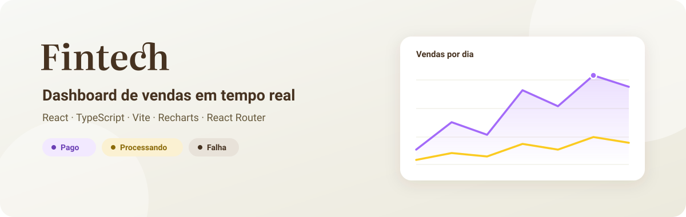
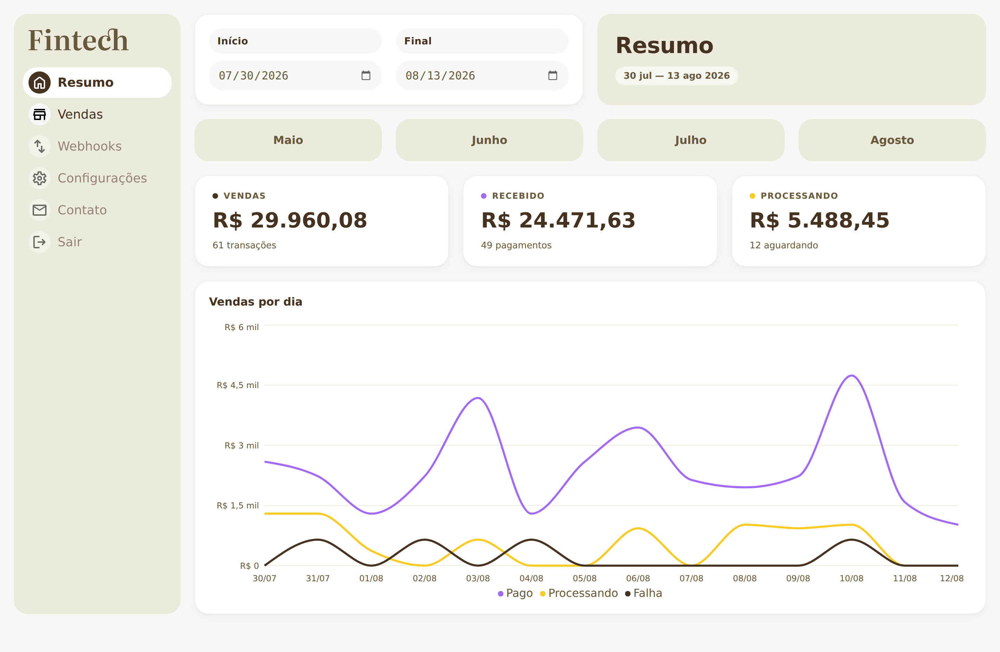
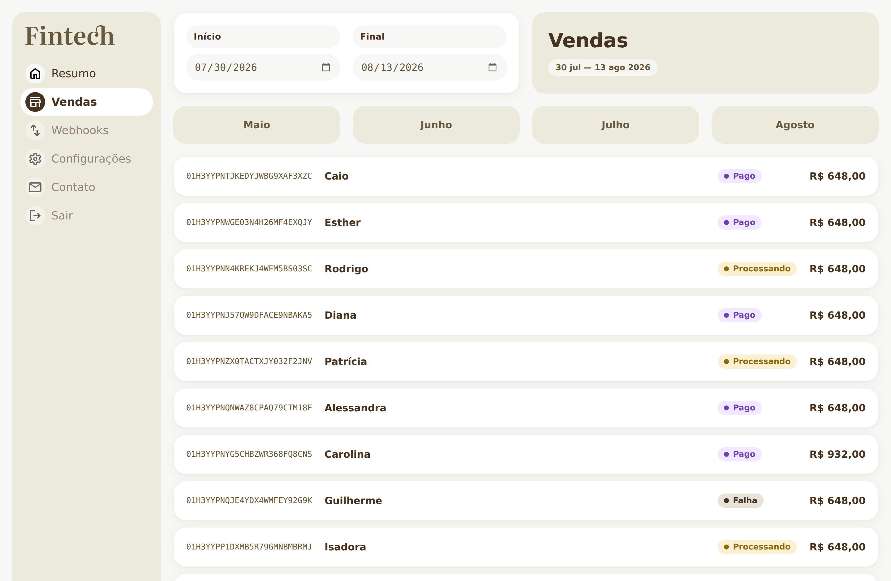
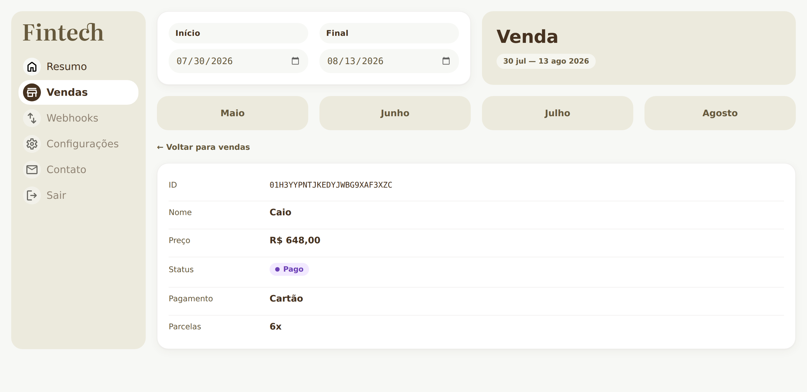
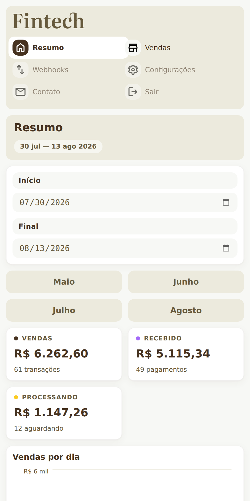
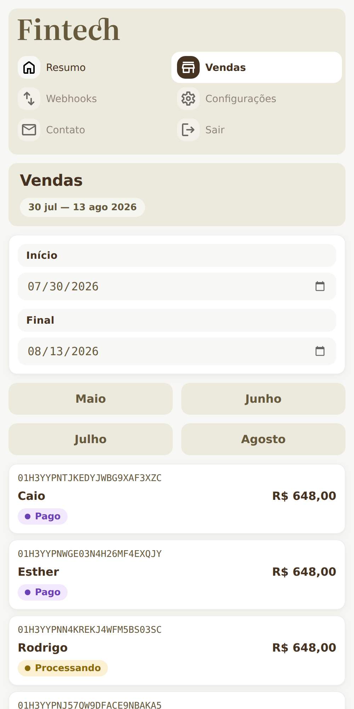

<div align="center">



<p>
  <a href="https://fintech-ts-seven.vercel.app/"></a>
  
  
  
</p>

<p><b><a href="https://fintech-ts-seven.vercel.app/">→ Abrir a demo</a></b></p>

</div>

---

## Sobre

**Fintech** é um dashboard de vendas construído com **React + TypeScript**. Ele consome uma API de
transações, agrega os valores por período e apresenta tudo em cartões de resumo, um gráfico de
linhas por dia e uma listagem navegável de vendas.

O projeto foi pensado como um estudo completo de front-end moderno: roteamento com URLs reais,
estado global via Context API, hooks próprios para *fetch* e animação de números, tipagem estrita
ponta a ponta e uma interface responsiva que respeita `prefers-reduced-motion`.

---

## Telas

### Resumo

Totais de **vendas**, **recebido** e **processando** com contagem animada, mais o gráfico de vendas
por dia separado por status.



### Vendas

Listagem completa do período, com ID, nome, status e valor. Cada linha leva ao detalhe.



### Detalhe da venda

Rota dinâmica `/vendas/:id` que busca a transação individual na API.



### Responsivo

Abaixo de 700px o layout vira coluna única, a navegação lateral vira grade e as linhas da listagem
se reorganizam.

<table>
<tr>
<td width="50%"></td>
<td width="50%"></td>
</tr>
<tr>
<td align="center"><sub><b>Resumo</b></sub></td>
<td align="center"><sub><b>Vendas</b></sub></td>
</tr>
</table>

---

## Funcionalidades

| | |
|---|---|
| 📊 **Gráfico por status** | Linhas separadas para `pago`, `processando` e `falha`, com tooltip customizado em BRL |
| 🗓️ **Filtro por período** | Campos de início/fim livres, mais atalhos para os **4 últimos meses** |
| 🔢 **Contagem animada** | `useContador` interpola os totais com `requestAnimationFrame` e easing cúbico |
| 🔗 **Rotas reais** | `/`, `/vendas` e `/vendas/:id` — com título do documento sincronizado |
| ⏳ **Estados de carga** | Telas dedicadas de *loading*, erro e período vazio |
| ♿ **Acessibilidade** | `prefers-reduced-motion`, foco visível, `aria-pressed` / `aria-disabled` |
| 📱 **Responsivo** | Breakpoints em 1000px e 700px |

---

## Stack

| Camada | Ferramenta |
|---|---|
| UI | [React 18](https://react.dev) |
| Linguagem | [TypeScript 5](https://www.typescriptlang.org) |
| Build | [Vite 4](https://vitejs.dev) |
| Rotas | [React Router 6](https://reactrouter.com) |
| Gráficos | [Recharts 2](https://recharts.org) |
| Estilo | CSS puro com *custom properties* |
| Deploy | [Vercel](https://vercel.com) |

Os dados vêm da API pública [`data.origamid.dev/vendas`](https://data.origamid.dev/vendas).

---

## Rodando localmente

```bash
git clone https://github.com/kessleru/fintech-ts.git
cd fintech-ts
npm install
npm run dev
```

O Vite sobe em `http://localhost:5173`.

### Scripts

| Comando | O que faz |
|---|---|
| `npm run dev` | Servidor de desenvolvimento com HMR |
| `npm run build` | Type-check + build de produção em `dist/` |
| `npm run preview` | Serve o build de produção localmente |
| `npm run lint` | ESLint com `--max-warnings 0` |

---

## Estrutura

```
src/
├── Components/      # Header, Sidenav, GraficoVendas, VendaItem, Status, Loading…
├── Context/         # DataContext — vendas + intervalo de datas
├── Hooks/           # useFetch (com abort) e useContador (animação de números)
├── Helpers/         # formatarPreco → Intl.NumberFormat pt-BR
├── Pages/           # Resumo, Vendas, Venda
├── assets/          # logo e ícones SVG
└── Style.css        # design tokens + layout
```

### Paleta

| Token | Cor | Uso |
|---|---|---|
| `--color-1` | `#463220` | Texto forte, estado ativo |
| `--color-2` | `#66593c` | Texto secundário |
| `--color-3` | `#eceadd` | Superfícies em destaque |
| `--color-4` | `#f7f8f5` | Fundo da página |
| `--pago` | `#a36af9` | Status pago |
| `--processando` | `#fbcb21` | Status processando |
| `--falha` | `#463220` | Status falha |

---

## Deploy

Hospedado na [Vercel](https://vercel.com), com deploy automático a cada push na `main`.

A configuração padrão do Vite já serve o app na raiz do domínio, então não há `base` a definir.
O único ajuste necessário é o de rotas: como este é um SPA, recarregar uma URL profunda como
`/vendas/:id` faria a Vercel procurar um arquivo nesse caminho e devolver 404. O
[`vercel.json`](vercel.json) redireciona tudo para o `index.html` e deixa o React Router resolver:

```json
{
  "rewrites": [{ "source": "/(.*)", "destination": "/index.html" }]
}
```

> [!NOTE]
> Se um dia for publicar em um subcaminho (GitHub Pages, por exemplo), aí sim é preciso definir
> `base: '/nome-do-repo/'` no `vite.config.ts` — e o `BrowserRouter` já acompanha, porque usa
> `basename={import.meta.env.BASE_URL}`.

---

<div align="center">
<sub>Feito por <a href="https://github.com/kessleru">Otávio Kessler Ustra</a></sub>
</div>
