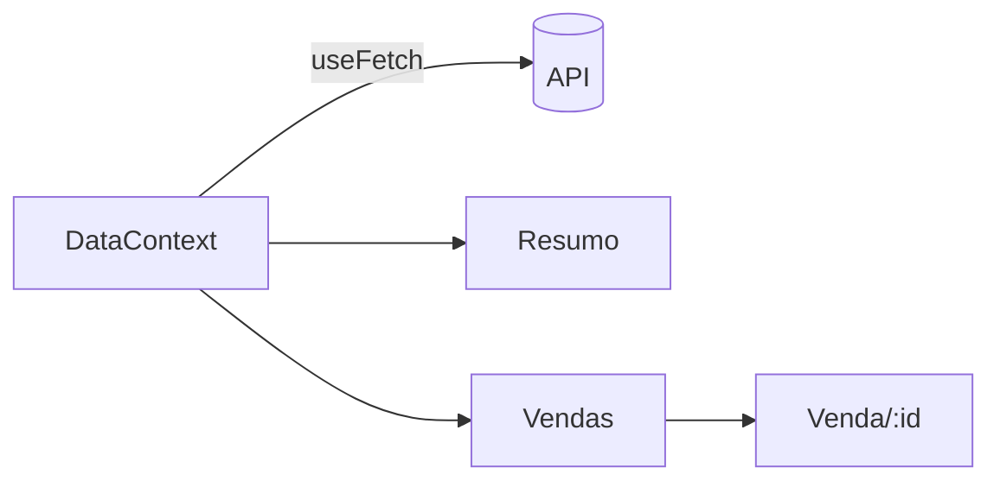

# Guia: como fazer um README impressionante

Playbook reutilizável para qualquer repositório. Escrito a partir de boas práticas atuais
(2026) e do que funcionou na prática ao montar o README deste projeto — incluindo as armadilhas
que só aparecem quando você tenta automatizar as imagens.

---

## 1. O princípio

Um README não é documentação. É uma **landing page**. O leitor chega com três perguntas e dá a
você cerca de 30 segundos:

1. **O que é isso?**
2. **Isso parece bom / funciona mesmo?**
3. **Como eu rodo?**

As três precisam ser respondidas **antes do primeiro scroll**. Tudo o mais — arquitetura,
contribuição, licença, roadmap — vem depois e pode ser longo. A regra prática que aparece em
praticamente toda análise de READMEs de sucesso: *imagem herói acima da dobra, quick-start nas
primeiras 200 palavras, badges que linkam para dados vivos*.

> [!IMPORTANT]
> A diferença entre um README "bom" e um "impressionante" quase nunca é o texto. É a **imagem**.
> Um projeto com screenshot real parece pronto; o mesmo projeto sem screenshot parece abandonado.
> Se você tem tempo para uma coisa só, faça a imagem.

---

## 2. Estrutura canônica

Nesta ordem. Corte o que não se aplica, mas não reordene.

```
┌─ Banner / logo                    ← identidade visual, largura total
├─ Uma linha do que o projeto faz   ← literal, sem marketing
├─ Badges (3 a 5, funcionais)       ← demo, build, versão, licença
├─ Link para a demo ao vivo         ← se existir, em destaque
├─ Screenshot herói                 ← a tela principal, acima da dobra
│
├─ Sobre / motivação                ← 2 parágrafos, no máximo
├─ Telas                            ← screenshots das rotas principais
├─ Funcionalidades                  ← tabela ou lista com ícones
├─ Stack                            ← tabela com links
├─ Rodando localmente               ← copiar e colar tem que funcionar
├─ Scripts                          ← tabela comando → efeito
├─ Estrutura de pastas              ← árvore comentada
├─ Deploy / arquitetura             ← o que não é óbvio no código
└─ Créditos / licença
```

### O checklist de 60 segundos

Antes de commitar, abra o README renderizado e confira:

- [ ] Dá para saber o que o projeto faz **sem rolar a página**?
- [ ] Tem pelo menos **uma imagem** na primeira tela?
- [ ] Os badges **linkam** para algo (não são decoração morta)?
- [ ] O bloco de instalação funciona **copiando e colando**, do zero, em máquina limpa?
- [ ] Todos os links de imagem resolvem? (`grep -o 'docs/[^)"]*' README.md` e teste cada um)
- [ ] Legível **no celular**? (tabelas largas quebram — prefira 2 colunas)
- [ ] Legível no **dark mode**? (banner com fundo claro fixo some em tema escuro)

---

## 3. Imagens — a parte que importa

### Hierarquia de impacto

Da melhor para a pior:

| Tipo | Impacto | Custo | Quando usar |
|---|---|---|---|
| **GIF / vídeo curto** do fluxo real | ⭐⭐⭐⭐⭐ | alto | app interativo, CLI |
| **Screenshot real** do app rodando | ⭐⭐⭐⭐ | médio (automatizável) | qualquer UI |
| **Banner SVG** desenhado à mão | ⭐⭐⭐ | médio | identidade, topo |
| **Diagrama** (Mermaid) | ⭐⭐⭐ | baixo | arquitetura, fluxo |
| Mockup genérico de estoque | ⭐ | baixo | evite |

> [!TIP]
> **Screenshot real > mockup desenhado.** Um mockup bonito de uma tela que não existe é
> desonesto e o leitor percebe. Automatize a captura da tela de verdade — leva 20 minutos e
> você pode regerar a qualquer momento.

### 3.1 Pipeline de screenshot automatizado

O melhor investimento. Um script que sobe o app, captura as telas e salva em `docs/screenshots/`.
Funciona em qualquer projeto web, sem instalar Puppeteer/Playwright — só o Chrome que você já tem.

```bash
#!/usr/bin/env bash
# docs/shot.sh — captura screenshots reais do app para o README
set -euo pipefail

BASE="${1:-http://127.0.0.1:4173}"     # URL do preview já rodando
OUT="docs/screenshots"
mkdir -p "$OUT"

shoot () {  # nome  caminho  largura  altura
  google-chrome --headless --no-sandbox --disable-gpu --hide-scrollbars \
    --disable-dev-shm-usage --force-device-scale-factor=2 \
    --window-size="$3,$4" --virtual-time-budget=20000 \
    --screenshot="$OUT/$1.png" "$BASE$2" 2>/dev/null
  echo "✓ $1"
}

shoot home          "/"          1440 940
shoot lista         "/vendas"    1440 940
shoot mobile-home   "/"           500 1000   # 500 é o MÍNIMO — veja armadilha nº1
```

Rode com o preview de produção no ar (`npm run preview` / `vite preview`), não o dev server —
você quer capturar o que o usuário vê.

#### As quatro armadilhas (todas custam tempo)

> [!WARNING]
> **1. O Chrome tem largura mínima de janela de 500px CSS.**
> Se você passar `--window-size=390,844` para simular um iPhone, o Chrome faz o layout a
> **500px** mas recorta a imagem em 390px — o lado direito some silenciosamente e você só
> percebe olhando com atenção. Use **500 ou mais** para capturas mobile. Para conferir, capture
> uma página que imprime `window.innerWidth` e compare com a largura do PNG.

> [!WARNING]
> **2. Animações de entrada congelam no meio.**
> `--virtual-time-budget` adianta os timers, mas animações CSS de entrada (`opacity: 0` →
> `1`) e animações JS de bibliotecas de gráfico frequentemente aparecem **pela metade**: cards
> invisíveis, linhas do gráfico ausentes. A solução é gerar um **build descartável** com as
> animações desligadas:
> ```bash
> cp src/Style.css /tmp/bkp.css
> echo '*,*::before,*::after{animation:none!important;transition:none!important}' >> src/Style.css
> # nas libs de gráfico: isAnimationActive={false}
> npx vite build --outDir dist-shot
> # …captura…
> cp /tmp/bkp.css src/Style.css && rm -rf dist-shot   # SEMPRE restaure
> ```
> Faça isso num diretório de saída separado e **restaure o código-fonte** antes de commitar.

> [!WARNING]
> **3. `--force-device-scale-factor=2` é obrigatório.**
> Sem ele o PNG sai em 1x e fica borrado em telas retina, que é onde a maioria vai ler. Com ele,
> `--window-size=1440,940` produz um PNG de 2880×1880. Exiba com `width="100%"` no HTML.

> [!WARNING]
> **4. `pkill -f 'meu-script'` mata o próprio shell.**
> O padrão casa com a linha de comando do wrapper que está executando o `pkill`. Use uma classe
> de caractere para o padrão não casar consigo mesmo: `pkill -f 'meu-scrip[t]'`.

#### Recortando e otimizando

```bash
# altura sob medida: meça o conteúdo antes de capturar, ou capture generoso e recorte
convert shot.png -trim +repage shot.png            # ImageMagick
pngquant --quality=70-90 --ext .png --force docs/screenshots/*.png   # ~60% menor
```

> [!NOTE]
> PNGs de 2x pesam. Mantenha cada um abaixo de ~400 KB. Um README com 5 MB de imagens demora
> visivelmente para abrir e o GitHub serve tudo via proxy sem lazy-load agressivo.

### 3.2 Banner SVG

**Use SVG, não PNG**, para o banner: escala perfeitamente, pesa poucos KB e você edita o texto
depois sem refazer nada. O GitHub renderiza SVG do próprio repositório normalmente.

Receita que funciona:

```
1200 × 380, cantos arredondados (rx=24)
├─ fundo: gradiente sutil entre duas cores da paleta DO PROJETO
├─ 1 ou 2 círculos brancos translúcidos (profundidade, opacity .35–.45)
├─ logo/wordmark à esquerda (cole o path do seu SVG real)
├─ título 27px semibold + subtítulo 18px com a stack
├─ 2–3 "pills" com os estados/conceitos do domínio
└─ à direita: um card branco com sombra mostrando um gráfico/UI estilizada
```

Duas regras: **puxe as cores dos design tokens do projeto** (`--color-1`, `--pago`…) para o
banner parecer parte do produto; e **inline tudo** (sem fonte externa — use
`font-family="system-ui,-apple-system,'Segoe UI',Roboto,sans-serif"`, que o GitHub renderiza).

```xml
<defs>
  <linearGradient id="bg" x1="0" y1="0" x2="1" y2="1">
    <stop offset="0%"   stop-color="#f7f8f5"/>
    <stop offset="100%" stop-color="#eceadd"/>
  </linearGradient>
  <filter id="card" x="-20%" y="-20%" width="140%" height="140%">
    <feDropShadow dx="0" dy="6" stdDeviation="14" flood-color="#463220" flood-opacity=".10"/>
  </filter>
</defs>
<rect width="1200" height="380" rx="24" fill="url(#bg)"/>
```

### 3.3 GIFs e demos

Para **app web**: grave a tela e converta com [Gifski](https://github.com/sindresorhus/Gifski)
(cores muito melhores) ou [ScreenToGif](https://github.com/NickeManarin/ScreenToGif).
Mantenha **abaixo de 10 s e 5 MB**, sem áudio, começando já no meio da ação.

Para **CLI/TUI**: use [VHS](https://github.com/charmbracelet/vhs). Você escreve um arquivo
`.tape` declarativo e ele renderiza o GIF — reproduzível, versionável e regerável em CI com
`charmbracelet/vhs-action`:

```tape
Output demo.gif
Set FontSize 20
Set Width 1200
Set Height 600
Type "npm run build"
Enter
Sleep 3s
```

Isso é muito superior a gravar a tela: quando o CLI muda, você regera o GIF no CI em vez de
regravar à mão.

### 3.4 Device frames / mockups

Só depois de ter o screenshot real. Coloque a captura dentro de uma moldura de browser ou
celular quando quiser reforçar "isso é um produto":

- [Screenhance](https://screenhance.com/mockup-generator) — 113 molduras, exporta PNG/GIF
- [mockup-factory](https://github.com/poyrazavsever/mockup-factory) — client-side, sem backend
- [deviceframe](https://github.com/c0bra/deviceframe) — CLI, automatizável
- [SnapMock](https://github.com/marketplace/actions/snapmock-screenshot-generator) — Action que
  captura o site publicado dentro de molduras e commita sozinho

---

## 4. Truques de Markdown do GitHub

### Imagens que se adaptam ao tema

Banner com fundo claro fixo **desaparece** no dark mode. Resolva com `<picture>`:

```html
<picture>
  <source media="(prefers-color-scheme: dark)"  srcset="docs/banner-dark.svg">
  <source media="(prefers-color-scheme: light)" srcset="docs/banner.svg">
  
</picture>
```

> [!NOTE]
> O atalho antigo `imagem.png#gh-dark-mode-only` foi descontinuado pelo GitHub. Use `<picture>`.
> Alternativa mais simples: desenhe o banner com fundo **neutro que funcione nos dois temas**,
> ou com o fundo transparente e cores de contraste médio.

### Alertas

Renderizam com ícone e cor. Use com parcimônia — 2 ou 3 no README inteiro:

```markdown
> [!NOTE] / [!TIP] / [!IMPORTANT] / [!WARNING] / [!CAUTION]
```

### Seções recolhíveis

Ótimo para não inflar a página com FAQ, troubleshooting ou logs longos:

```html
<details>
<summary><b>Como configurar variáveis de ambiente</b></summary>

Conteúdo aqui dentro, incluindo blocos de código.

</details>
```

### Duas imagens lado a lado

Markdown puro não faz. Tabela HTML faz — é o padrão para mostrar mobile + desktop:

```html
<table>
<tr>
  <td width="50%"></td>
  <td width="50%"></td>
</tr>
<tr>
  <td align="center"><sub><b>Resumo</b></sub></td>
  <td align="center"><sub><b>Vendas</b></sub></td>
</tr>
</table>
```

### Diagramas Mermaid

Renderizam nativamente **e seguem o tema do leitor** automaticamente. Melhor que uma imagem de
arquitetura, porque é editável em texto:

````markdown

````

### Badges

**3 a 5, todas funcionais e linkando para dados vivos.** Badge decorativa que não linka para
nada é ruído. Use `style=for-the-badge` para um visual consistente e **cores da sua paleta**:

```markdown
[](https://user.github.io/repo/)
[](../../actions)
```

As que valem a pena: **demo ao vivo**, **status do CI**, **versão/release**, **licença**.
As que não valem: contador de visitas, "made with love", badges de tecnologia sem link.

### Centralização

O GitHub aceita `<div align="center">` — use no bloco do topo (banner, badges, link da demo) e
no rodapé. **Não** centralize o corpo do texto: prejudica muito a leitura.

---

## 5. Erros comuns

| Erro | Por quê |
|---|---|
| README sem imagem nenhuma | Projeto parece morto |
| Screenshot desatualizado | Pior que nenhum — quebra a confiança |
| Muro de badges (10+) | Vira ruído, ninguém lê |
| Instalação que não funciona copiando | Motivo nº1 de abandono |
| Descrição vaga ("um app moderno e robusto") | Não diz nada; seja literal |
| Imagem de 8 MB no topo | Página demora a carregar |
| Banner claro sem versão dark | Some para metade dos leitores |
| Documentar o óbvio do código | Documente o que **não** dá para inferir lendo o repo |
| Tabelas de 6 colunas | Quebram no celular |

---

## 6. Prompt reutilizável

Cole isto no Claude Code dentro de qualquer repositório:

```
Faça um README impressionante para este repositório, seguindo docs/guia-readme.md.

Antes de escrever:
1. Leia o código para entender o que o projeto realmente faz — funcionalidades,
   stack, rotas/comandos, e a paleta de cores dos design tokens.
2. Gere as imagens de verdade:
   - um banner SVG usando as cores do próprio projeto;
   - screenshots REAIS: suba o build de produção e capture com Chrome headless
     em 2x (desktop 1440 e mobile 500 — 500 é o mínimo do Chrome).
     Se as animações de entrada congelarem, gere um build descartável com as
     animações desligadas e restaure o código-fonte depois.
3. Salve em docs/banner.svg e docs/screenshots/.

Depois escreva o README na estrutura do guia e verifique que todas as imagens
referenciadas existem no disco.
```

---

## 7. Referências

**Exemplos que valem estudar** (todos citados no [awesome-readme](https://github.com/matiassingers/awesome-readme)):

| Repo | O que roubar |
|---|---|
| [ai/size-limit](https://github.com/ai/size-limit#readme) | Logo + screenshot + instalação passo a passo, muito enxuto |
| [amitmerchant1990/electron-markdownify](https://github.com/amitmerchant1990/electron-markdownify#readme) | GIF de demo perfeito logo no topo |
| [gofiber/fiber](https://github.com/gofiber/fiber#readme) | Badges bem escolhidas, quickstart, gráficos de benchmark |
| [httpie/httpie](https://github.com/httpie/httpie#readme) | Screenshots de terminal, seções de instalação por SO |
| [ryanoasis/nerd-fonts](https://github.com/ryanoasis/nerd-fonts#readme) | Diagrama Sankey e ícones por sistema operacional |

**Templates e guias:** [Best-README-Template](https://github.com/othneildrew/Best-README-Template) ·
[Make a README](https://www.makeareadme.com/) ·
[Standard Readme](https://github.com/RichardLitt/standard-readme#readme) ·
[Art of README](https://github.com/hackergrrl/art-of-readme)

**Ferramentas:** [shields.io](https://shields.io) (badges) ·
[VHS](https://github.com/charmbracelet/vhs) (demo de CLI) ·
[Gifski](https://github.com/sindresorhus/Gifski) (GIF) ·
[Screenhance](https://screenhance.com/mockup-generator) (molduras) ·
[pngquant](https://pngquant.org) (otimização)
